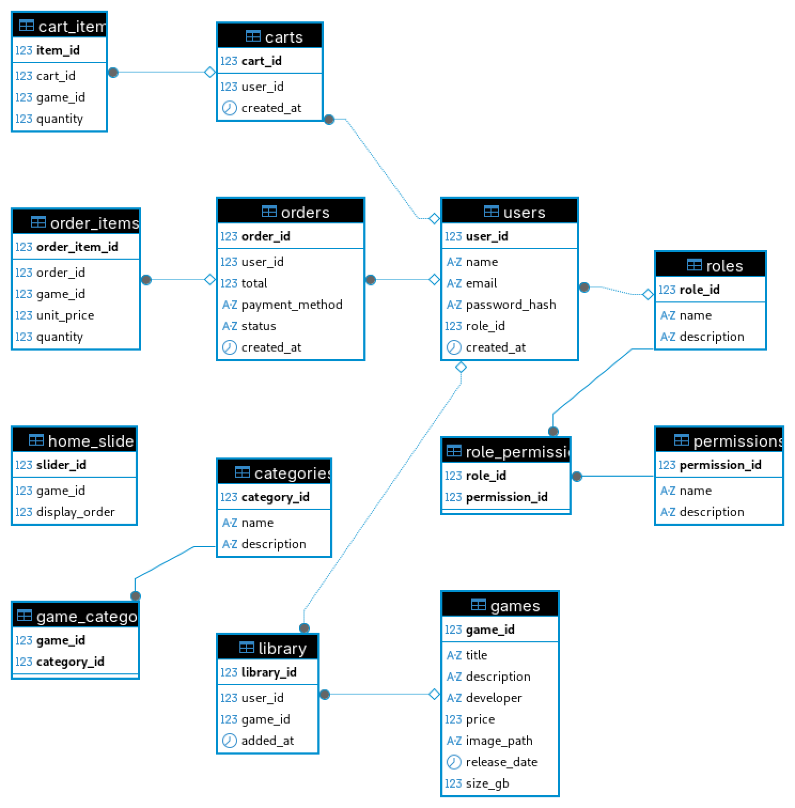

# PixelGate

PixelGate é uma plataforma web para gerenciamento de jogos, usuários, permissões, categorias e vendas, desenvolvida como projeto acadêmico.  
O sistema possui painel administrativo completo, autenticação, controle de permissões, CRUDs para todas as entidades e integração com banco de dados relacional.

---

# Relatório Anual de Aprendizagem – DW1

Durante o desenvolvimento do projeto da disciplina de DW1, pude aprofundar meus conhecimentos principalmente em backend, rotas e modelagem de banco de dados relacional. O projeto envolveu a criação de uma plataforma web para gerenciamento de jogos, usuários, permissões, categorias e vendas, com painel administrativo, autenticação, controle de permissões e CRUDs.

## Experiências por Bimestre

**1º Bimestre:**
O projeto foi mais simples, com apenas três páginas utilizando HTML, CSS e JS básico. As principais dificuldades foram relacionadas ao CSS, para deixar o visual do jeito que eu queria. A estrutura era mais enxuta e não envolvia backend ou banco de dados.

**2º Bimestre:**
O mesmo projeto foi expandido para incluir um painel administrativo para produtos e usuários. Apenas usuários administradores podiam acessar essas áreas. O nível de complexidade aumentou bastante, principalmente porque o servidor e o backend eram novidades para mim. Tive dificuldades para organizar o código e estruturar o backend, o que acabou deixando o projeto mal organizado.

**3º e 4º Bimestres:**
Consegui evoluir bastante. Os modelos e exemplos oferecidos pelo professor foram fundamentais para entender a estrutura ideal do backend, como organizar as rotas, controllers e a lógica de permissões. Com isso, consegui entregar todas as funcionalidades propostas, incluindo relatórios administrativos, exportação para PDF, filtros avançados e integração segura com o banco de dados.

## Experiência com IA

A experiência com IA foi marcante. No início, tive dificuldades com algumas ferramentas, mas ao longo do ano me adaptei e passei a preferir o GitHub Copilot para programação. O Copilot se mostrou eficiente para acelerar tarefas repetitivas, sugerir trechos de código e ajudar na sintaxe, principalmente no backend. A IA foi mais útil para automação de rotinas e geração de código padrão, mas sempre precisei revisar e adaptar as sugestões para garantir o funcionamento correto do sistema.

## Preferências

Minha preferência ficou clara pelo backend, especialmente na criação de rotas, controllers e modelagem do banco de dados. Gosto da lógica envolvida, da segurança e da organização que o backend proporciona. O frontend também foi importante, mas considero o backend mais desafiador e gratificante.

No geral, consegui entregar o esperado no projeto final do 3º/4º bimestre, superando as dificuldades iniciais. O apoio dos modelos do professor e a adaptação ao uso de IA foram essenciais para meu desenvolvimento na disciplina.

---

## 📦 Funcionalidades

- Cadastro e autenticação de usuários
- Gerenciamento de cargos e permissões (ACL)
- CRUD de jogos, categorias, usuários, cargos, permissões
- Biblioteca de jogos do usuário
- Carrinho de compras
- Painel administrativo protegido por permissões
- Responsividade e usabilidade aprimoradas

---

## 🗄️ Modelo do Banco de Dados

O banco de dados foi modelado conforme o diagrama abaixo:



---

## 🚀 Como rodar o projeto

1. Clone o repositório
2. Instale as dependências do backend e frontend
3. Configure o banco de dados do projeto no arquivo database.js e pgAdmin
4. Execute os scripts de criação e inserção que estão em `/backend/data/createTables.sql` e `/backend/data/insert.sql`
5. Para iniciar o servidor:
   ```bash
   npm install
   cd backend
   node server.js
   ```
6. Inicie o frontend, abrindo o link do servidor no console

---

## 🛠️ Testes das APIs

Todas as APIs REST foram testadas utilizando o [Postman](https://www.postman.com/), garantindo o funcionamento dos endpoints de autenticação, CRUDs e permissões.

---

## 📹 Vídeo no Youtube, explicando projeto do 3º bimestre

*https://youtu.be/VYo7f5ZxfyE*
