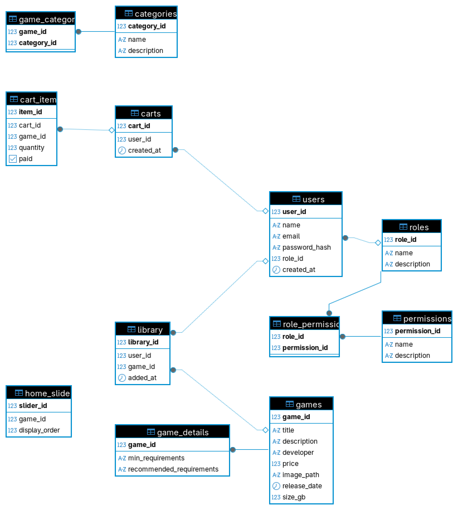

# PixelGate

PixelGate é uma plataforma web para gerenciamento de jogos, usuários, permissões, categorias e vendas, desenvolvida como projeto acadêmico.  
O sistema possui painel administrativo completo, autenticação, controle de permissões, CRUDs para todas as entidades e integração com banco de dados relacional.

---

## 📦 Funcionalidades

- Cadastro e autenticação de usuários
- Gerenciamento de cargos e permissões (ACL)
- CRUD de jogos, categorias, usuários, cargos, permissões
- Biblioteca de jogos do usuário
- Carrinho de compras
- Painel administrativo protegido por permissões
- Responsividade e usabilidade aprimoradas

---

## 🗄️ Modelo do Banco de Dados

O banco de dados foi modelado conforme o diagrama abaixo:



---

## 🚀 Como rodar o projeto

1. Clone o repositório
2. Instale as dependências do backend e frontend
3. Configure o banco de dados (PostgreSQL)
4. Execute os scripts de criação e inserção em `/backend/data/createTables.sql` e `/backend/data/insert.sql`
5. Inicie o backend:  
   ```bash
   cd backend
   npm install
   npm start
   ```
6. Inicie o frontend (basta abrir os arquivos HTML em `/frontend` ou servir via servidor local)

---

## 🛠️ Testes das APIs

Todas as APIs REST foram testadas utilizando o [Postman](https://www.postman.com/), garantindo o funcionamento dos endpoints de autenticação, CRUDs e permissões.

---

## 📹 Demonstração em vídeo

Em breve será disponibilizado um vídeo no YouTube apresentando o funcionamento do sistema e suas principais funcionalidades.

---

## 📚 Documentação extra

- O código está comentado e organizado por módulos.
- As permissões do painel administrativo são controladas pelo backend e frontend.
- O sistema é facilmente extensível para novas entidades.

---

## 👨‍💻 Autor

Projeto desenvolvido por Victor para fins acadêmicos.
